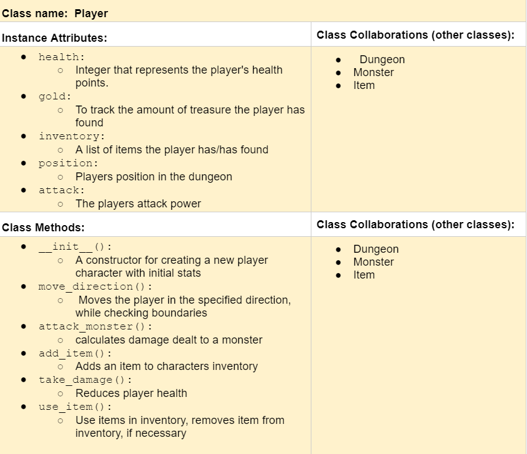

# ❗CSC226 Final Project

## Instructions

❗️Exclamation Marks ❗️indicate action items; you should remove these emoji as you complete/update the items which 
  they accompany. (This means that your final README should have no ❗️in it!)

️**Author(s)**: Kirsten Fuson

**Google Doc Link**: https://docs.google.com/document/d/1K2Ult_9eZ7bWyDMxQHnbboVqMiqreudtSwFlgg9h9ko/edit?usp=sharing

---

## References 
Throughout this project, you have likely used outside resources. Reference all ideas which are not your own, 
and describe how you integrated the ideas or code into your program. This includes online sources, people who have 
helped you, AI tools you've used, and any other resources that are not solely your own contribution. Update as you go.
https://www.pygame.org/docs/ref/display.html
https://www.pygame.org/docs/ref/sprite.html
https://github.com/search?q=pygame.sprite.collide_rect+language%3APython&type=Code&l=Python
https://www.pygame.org/docs/ref/sprite.html#pygame.sprite.Sprite.kill
https://www.pygame.org/docs/ref/sprite.html#pygame.sprite.collide_rect
---

## Milestone 1: Setup, Planning, Design

️**Title**: `The Creatures’ Keep`

**Purpose**: `My project will be like a dungeon crawler. I want it to be a game where you fight monsters, get treasure, and move to the next level until the character either dies, or the player makes it out with all their gold.`

**Source Assignment(s)**: `T11(The Legends of Tuna: Breath of Catnip),t12(Events and GUIs), T01(Choose Your Own Adventure), HW07(The Game of Nim)`

**CRC Card(s)**:
  - Create a CRC card for each class that your project will implement.
  - See this link for a sample CRC card and a template to use for your own cards (you will have to make a copy to edit):
    [CRC Card Example](https://docs.google.com/document/d/1JE_3Qmytk_JGztRqkPXWACJwciPH61VCx3idIlBCVFY/edit?usp=sharing)
  - Tables in markdown are not easy, so we suggest saving your CRC card as an image and including the image(s) in the 
    README. You can do this by saving an image in the repository and linking to it. See the sample CRC card below - 
    and REPLACE it with your own:
  





**Branches**: This project will **require** effective use of git. 

Each partner should create a branch at the beginning of the project, and stay on this branch (or branches of their 
branch) as they work. When you need to bring each others branches together, do so by merging each other's branches 
into your own, following the process we've discussed in previous assignments: 

```
    Branch 1 name: fusonk
    Branch 2 name: _____________
```
---

## Milestone 2: Code Setup and Issue Queue

Most importantly, keep your issue queue up to date, and focus on your code. 🙃

Reflect on what you’ve done so far. How’s it going? Are you feeling behind/ahead? What are you worried about? 
What has surprised you so far? Describe your general feelings. Be honest with yourself; this section is for you, not me.

```
    **Currently, I feel like Im behind. I know my game seems like its going to be pretty big, so im just going to try and slow it down. By that I mean I will focus on
    one class at a time, and make sure the most important parts of the game are working before I move on. Im honestly suprised by how much goes into a game that at first glance
    would feel pretty simple, but then you look at everything that goes into that kinda game, and its a lot of code being used to make it happen, even for the more simple things.
```

---

## Milestone 3: Virtual Check-In

Indicate what percentage of the project you have left to complete and how confident you feel. 

❗️**Completion Percentage**: `45%`

❗️**Confidence**: Describe how confident you feel about completing this project, and why. Then, describe some 
  strategies you can employ to increase the likelihood that you'll be successful in completing this project 
  before the deadline.

```
    **I don't feel confident about finishing everything that I wanted to do with this assignment. I took on a lot, and
    the code was ended up being more complicated to implement, which I knew it was going to be. Some strategies to increase the likeleyhood I'll be
    successful in completing the project are by lowering the scope of my project. By that I mean to do what is necessary to get the code working and worry about
    the look and feel a bit after. Maybe doing something more like stages rather than seperate rooms, such as having monsters spawn after each stage, and having a 
    the death be the end of the game, or a set number of monsters you have to fight to win. I will also work on it a bit more over the weekend, aswell as the week coming up.
```

---

## Milestone 4: Final Code, Presentation, Demo

### ❗User Instructions
In a paragraph, explain how to use your program. Assume the user is starting just after they hit the "Run" button 
in PyCharm. 

### ❗Errors and Constraints
Every program has bugs or features that had to be scrapped for time. These bugs should be tracked in the issue queue. 
You should already have a few items in here from the prior weeks. Create a new issue for any undocumented errors and 
deficiencies that remain in your code. Bugs found that aren't acknowledged in the queue will be penalized.

### ❗Reflection
In three to four well-written paragraphs, address the following (at a minimum):
- Why did you select the project that you did?
- How closely did your final project reflect your initial design?
- What did you learn from this process?
- What was the hardest part of the final project?
- What would you do differently next time, knowing what you know now?
- (For partners) How well did you work with your partner? What made it go well? What made it challenging?